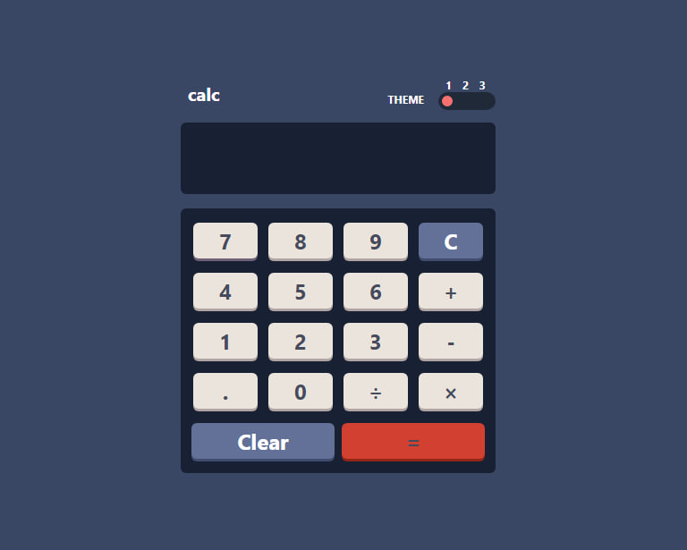

# Calculator program
This app helps you to do your math calculations with it. It is made with three different themes. I hope you enjoy it. Read the following for more information. Thank you for your cooperation.



## 🌟 Overview
Project is an advanced task management tool designed to help individuals and teams stay organized. With real-time collaboration, powerful analytics and a user-friendly interface, this is the only tool you need!

This program helps you to:
- See the size of the elements based on the screen size of your device (responsive)
- You can perform mathematical operations such as addition, subtraction, multiplication and division
- Change the color theme based on your preference.


## 🚀 Installation

1. Clone the repository:
   ```bash
   git clone https://github.com/samanezarini/Calc-react
   
2. Navigate to the project folder:
   ```bash
   cd your-project

3. Install dependencies:
   ```bash   
   npm install
   
4. Start the development server: 
   ```bash
   npm run dev


## 💻 Usage
1. Open the app in your browser at `http://localhost:3000`.
2. Sign up for an account.
3. Start creating and managing your tasks.

### Links

- Solution URL: [solution URL here](https://github.com/samanezarini/Calc-react)
- Live Site URL: [Live site URL here](https://calc-react-delta.vercel.app/)


## ✨ Features
- 📆 Performing mathematical calculations
- 👥 Collaboration in real time
- 📊 Check the entered numbers and data
- 🌙 Three color themes, light, dark, medium


## My process

### Built with

- Semantic HTML5 markup
- CSS Tailwand properties
- Flexbox
- CSS Grid
- Mobile-first workflow
- [React](https://reactjs.org/) - JS library
- [Styled Components](https://styled-components.com/) - For styles

## 🤝 Contributing
Contributions, issues, and feature requests are welcome!  
Feel free to check the [issues page](https://github.com/your-username/your-project/issues).

1. Fork the repository
2. Create your feature branch:
   ```bash
   git checkout -b feature/your-feature-name
3. Commit your changes:
   ```bash 
   git commit -m "Add your feature"

4. Push to the branch:
   ```bash
   git push origin feature/your-feature-name

## 📬 Contact
- Email: samane_zarini@yahoo.com
- GitHub: [@samanezarini](https://github.com/samanezarini)

Thank you for your participation and valuable companionship
